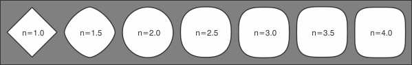
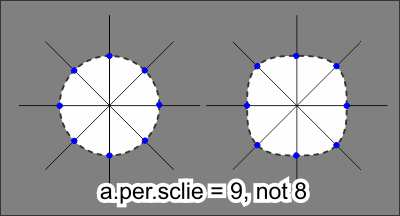
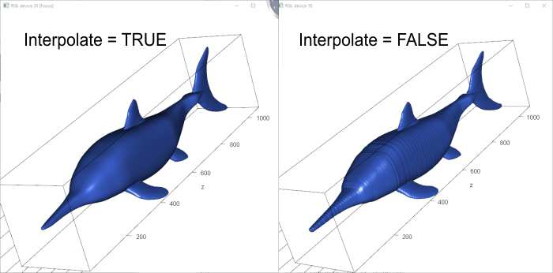
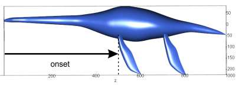
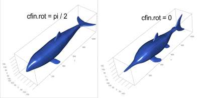
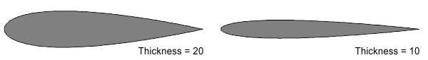
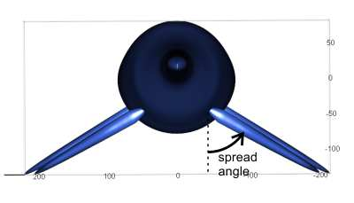
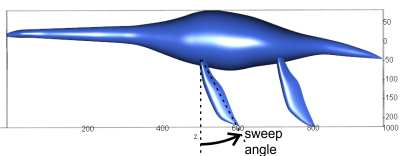
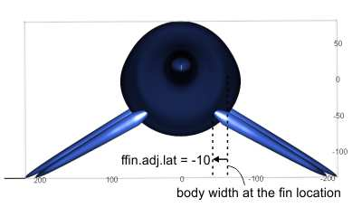

# Categorized Command Option List
Below is a categorized and illustrated list of options for paleomass().
## Options for Data Input

- Folder ...... Name of the sub-directory of the working directory storing image files.
- File.Ext .........File extension of the image file. Either ".bmp",".jpg",".png", or "", the last one for without extensions.
- BodyL.File ...... Name of the image file for the lateral silhouette of the body, without extension.
- BodyV.File ...... Name of the image file for the ventral silhouette of the body, without extension.
- Cfin.File ....... Name of the image file for the planar silhouette of the caudal fin, without extension.
- Dfin.File ....... Name of the image file for the planar silhouette of the dorsal fin, if any, without extension.
- D2fin.File ..... Name of the image file for the planar silhouette of the second dorsal fin, if any, without extension.
- Ffin.File ...... Name of the image file for the planar silhouette of the forefin/pectoral fin/pectoral flipper.
- Hfin.File ...... Name of the image file for the planar silhouette of the hindfin/pelvic fin/pelvic flipper, without extension.
- Afin.File ...... Name of the image file for the planar silhouette of the anal fin, if any, without extension.
- Ceph.File ...... Name of the image file for the planar silhouette of the cephalofoil, if any, without extension.

## Options Concerning Shapes
- n1 ...... Superelliptical exponent used in the first model. See [Wikipedia](https://en.wikipedia.org/wiki/Superellipse) for what superellipses are--in short, they are a mathematical extension of ellipses and contain the latter as a part. It is recommended to use n1 = 2 and n2 = 3 to bracaket the true volume of a marine tetrapod.

	
- n2 ...... Superelliptical exponent used in the second model. See above.
- a.per.slice ...... Number of angular division per superelliptical slice plus 1, that is, how many points are placed around a superellipse with one pair of redundant points. The default value is 181, i.e., there is a point every 2 degrees.

	
- Interpolate ...... Logical. Whether to smooth the outline coordinates with local regression. TRUE is recommended because the resulting 3D model may suffer from extensive non-manifold vertices if the shape is not smoothed. If this happens, the volume cannot be calculated.

	
- nn.b ...... Nearest neighbor component of locfit() used for body reconstruction when interpolating.
- nn.f ...... Nearest neighbor component of locfit() used for fin/flipper reconstruction when interpolating.
- Use.Weight ...... Logical. Whether to add weight to the tips when using locfit()
- Add.Tip ...... Logical. Whether to add tips and the two ends of an object. TRUE is recommended to close the holes generated at the tips. If TRUE, then a small circle of a radius specified by tip.radius (0.0001 pixel by default) is added, while the existing points are shifted inward by tip.radius. This affects the shape minimally while closing the tips.
- tip.radius ...... Radius of the tip to be added. A value of 0.0001 is recommended.
- Body.Y.Centering ...... Logical. Whether to center the body along the Y axis.
- N.Body.Slice ...... How to set the number of longitudinal segments. Possible values are: "asis"--use the pixel count from input image; "round"(default)--round the value to the closest 100; " provided"--use the value provided in n.body.slice
- n.body.slice ...... Number of segments along the body axis. Moot unless N.Body.Slice = "provided".
- N.Fin.Slice ...... How to set the number of spanwise segments. Possible values are: "asis"--use the pixel count from input image; "round"(default)--round the value to the closest 100; " provided"--use the value provided in n.fin.slice
- n.fin.slice ...... umber of segments along the span of the fin. Moot unless N.Fin.Slice = "provided".

## Options Concerning Volume, Area, and Mass Calculation
- fork.l ...... Fork length of the marine vertebrate in meters.
- dens ...... Arbitrary specific gravity of whole body in g/cm^3.

## Options for Saving/Plotting
- Save.Csv ...... Logical. Whether to save a CSV file containing measurement results.
- Save.Part.Mesh ...... Logical. Whether to save .ply files of each body part
- Save.Total.Mesh ...... Logical. Whether to save .ply files of combined body parts.
- Plot.Result.Mesh ...... Logical. Whether to plot resulting meshes.
- N.Mesh.Window ...... A string of "two" or "one". Whether to plot two models side by side in one window or not. One window would often kill R.
- Mesh.Col ...... Color of the mesh in rgl window. Not reflected in the saved .ply files.

## Fin/Flipper/Cephalofoil Positions and Orientations

### Caudal fin
- cfin.adj.lat ...... Position adjustment along the X axis (bilateral axis) for the caudal fin, in pixels.
- cfin.adj.up ...... Position adjustment along the Y axis (dorso-ventral axis) for the caudal fin, in pixels.
- cfin.onset ...... Position adjustment along the Z axis (cranio-caudal axis) for the caudal fin, in pixels.

	
	
- cfin.rot ...... Rotation angle of the caudal fin around Z axis (cranio-caudal axis). 0 for - vertical, pi/2 for horizontal fins.

	

- cfin.sweep ...... Sweep angle of the caudal fin around the X axis (bilateral axis). See Forefin below. Becomes a yaw angle when cfin.rot = pi/2.
- cfin.thick ...... Maximum thickness of the caudal fin relative to the chord in percentage.

	

- cfin.yaw ...... Yaw angle of the caudal fin around the Y axis (dorso-ventral axis). Becomes a pitch (=sweep) angle when cfin.rot = pi/2.
### Dorsal fin
- dfin.adj.up ...... Position adjustment along the Y axis (dorso-ventral axis) for the dorsal fin, in pixels.
- dfin.onset ...... Position adjustment along the Z axis (cranio-caudal axis) for the dorsal fin, in pixels.
- dfin.sweep ...... Sweep angle of the dorsal fin around the X axis (bilateral axis).
- dfin.thick ...... Maximum thickness of the dorsal fin relative to the chord in percentage.

### Second dorsal fin
- d2fin.adj.up ...... Position adjustment along the Y (dorso-ventral axis) axis for the second dorsal fin, in pixels.
- d2fin.onset ...... Position adjustment along the Z axis (cranio-caudal axis) for the secod dorsal fin, in pixels.
- d2fin.sweep ...... Sweep angle of the second dorsal fin around the X axis (bilateral axis).
- d2fin.thick ...... Maximum thickness of the second dorsal fin relative to the chord in percentage.

### Forefin/pectoral fin/pectoral flipper
- ffin.spread ...... Rotation angle of the forefin around the Z axis (cranio-caudal axis).

	
- ffin.sweep ...... Sweep angle of the forefin around the X axis (bilateral axis).

	
- ffin.adj.lat ...... Position adjustment along the X axis (bilateral axis) for the forefin, in pixels.

	

- ffin.adj.up ...... Position adjustment along the Y axis (dorso-ventral axis) for the forefin, in pixels.
- ffin.onset ...... Position adjustment along the Z axis (cranio-caudal axis) for the forefin, in pixels.
- ffin.thick ...... Maximum thickness of the forefin relative to the chord in percentage.

### Hindfin/pelvic fin/pelvic flipper
- hfin.spread ...... Rotation angle of the hindfin around the Z axis (cranio-caudal axis).
- hfin.sweep ...... Sweep angle of the hindfin around the X axis (bilateral axis).
- hfin.adj.lat ...... Position adjustment along the X axis (bilateral axis) for the hindfin, in pixels.
- hfin.adj.up ...... Position adjustment along the Y axis (dorso-ventral axis) for the hindfin, in pixels.
- hfin.onset ...... Position adjustment along the Z axis (cranio-caudal axis) for the hindfin, in pixels.
- hfin.thick Maximum thickness of the hindfin relative to the chord in percentage.

### Anal fin
- afin.adj.up ...... Position adjustment along the Y axis (dorso-ventral axis) for the anal fin, in pixels.
- afin.onset ...... Position adjustment along the Z axis (cranio-caudal axis) for the anal fin, in pixels.
- afin.sweep ...... Sweep angle of the anal fin around the X axis (bilateral axis).
- afin.thick ...... Maximum thickness of the anal fin relative to the chord in percentage.

### Cephalofoil
- ceph.adj.up ...... Position adjustment along the Y axis (dorso-ventral axis) for the cephalofoil, in pixels.
- ceph.onset ...... Position adjustment along the Z axis (cranio-caudal axis) for the cephalofoil, in pixels.
- ceph.rot ...... Rotation angle of the cephalofoil around Z axis (cranio-caudal axis). pi/2 for horizontal cephalfoil.
- ceph.sweep ...... Sweep angle of the cephalofoil around the X axis (bilateral axis).
- ceph.thick ...... Maximum thickness of the cephalofoil relative to the chord in percentage.

## Test-run 
- Test.Run ...... Whether to set the positions and rotations of fins for a test run
