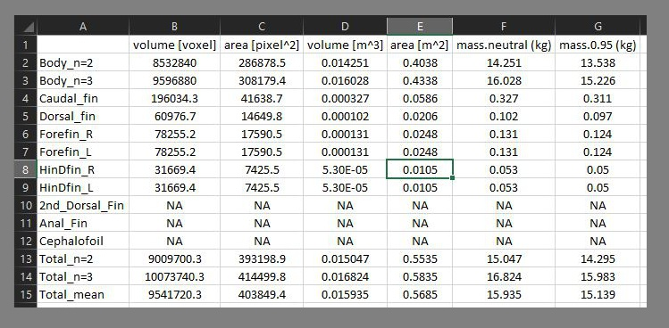
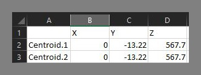
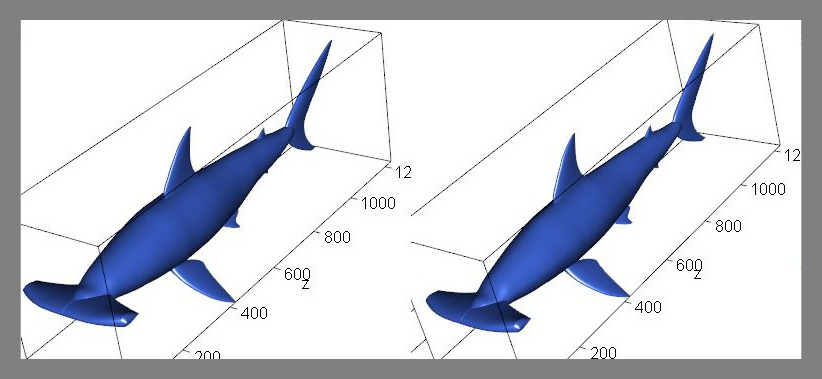
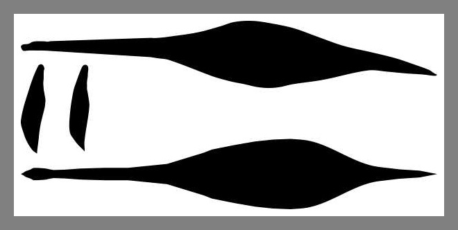
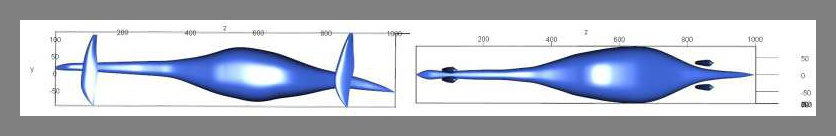

R package for volume and surface area estimation of vertebrates through bracketing between 3D models with superelliptical cross-sections

---

## What It Does

This package first builds two 3D models of a marine vertebrate based on two orthogonal body silhouettes and planar views of the flippers and fins, supplied as image files. The true volume and surface area of the animal is expected to be bracketed between those of the two models. The two models have superelliptical cross-sections for the body but they differ in the superellipticla exponent. Flippers are modeled with NACA00XX foil sections. Details of the principle and its test are given in:

Motani, R. Estimating body mass from silhouettes: Testing the assumption of elliptical body cross-sections. Paleobiology 27, 735–750 (2001). 

[Link](https://doi.org/10.1666/0094-8373(2001)027%3C0735:EBMFST%3E2.0.CO;2)   
[PDF](./img/Motani_2001_Body_Mass.pdf)

---

## Installation
Follow this 
[Link.](./Install.md)
If dependencies are not installed automatically, make sure to install the packages listed there.

---

## Command Options Explained Better
Follow this 
[Link.](./Options.md)

---

## Quick Start

### Simplest Example Run

1. Load the paleomass package in R.  
```R
library(paleomass)
```
2. If you haven't, move to the working directory that you want to use.  
```R
setwd("YourDirectory")
```
3. Save example silhouette image files, of the ichthyosaur *Stenopterygius*, in a sub-directory called "Stenopterygius".  
```R
save_Stenopterygius()
```
4. Run paleomass.   
```R
paleomass()
```
5. You will see several rgl windows open and close but that is normal. In the end, you will have the 3D models displayed and also saved as .ply files, so that  you can open it later in software of your choice. The .ply files are found in the sub-directory that contains the silhouette images.

	

6. You will also get calculation results displayed in the console and also save in .csv files.

	  
	


### Plesiosaur Example Run

1. As in the simplest example above.
2. As in the simplest example above.
3. Save silhouette image files for *Plesiosaurus*.  The images will be saved in a sub-directory named "Plesiosaurus".
```
save_Plesiopteryx()
```
4. Run paleomass. You need to specify the data folder, length of the animal, and the positions/rotations of the flippers as below.  
```R
paleomass(Folder = "Plesiopteryx", body.axis.l = 2.94, ffin.onset = 0.45, 
	hfin.onset = 0.65, ffin.adj.lat = -20, hfin.adj.lat = -60, 
	ffin.adj.up = 0, hfin.adj.up = 400, ffin.pitch = pi/6, 
	hfin.pitch =  pi/7, ffin.roll = pi/3, hfin.roll = pi/4)
```
5. You will get estiamted volumes and surface areas, as well as the 3D models. Apart from being displayed in R, the values are saved in a .csv file while the models are saved as .ply files so that you can open it later in software of your choice. These files are found in the sub-directory containing the silhouette image files.

	


### Hammerhead Example Run

1. As in the simplest example above.
2. As in the simplest example above.
3. Save example silhouette image files for *Sphyrna*, in a sub-directory called "Sphyrna".  
```R
save_Sphyrna()
```
4. Run paleomass. You need to specify the data folder, length of the animal, and the positions/rotations of the paired fins, median fins, and cephalofoil as below.  
```R
paleomass(Folder="Sphyrna", body.axis.l = 2, n2 = 1.8, nn.f=0.2,
	ffin.onset = 0.3, ffin.adj.up = 60, ffin.adj.lat = -60, 
	ffin.roll = pi/4, ffin.pitch = pi*15/180, hfin.onset = 0.55, 
	hfin.adj.up = 60, hfin.adj.lat = -80, hfin.roll = pi/4, 
	hfin.thick = 10, hfin.pitch = pi*10/180, cfin.onset = 0.92, 
	cfin.adj.up = 70, dfin.onset = 0.35, dfin.adj.up = 0, 
	dfin.pitch = 0, d2fin.onset = 0.8, d2fin.adj.up = 0,
	d2fin.pitch=pi*10/180, d2fin.thick=10, afin.onset = 0.8, 
	afin.adj.up = 20, afin.pitch = pi*15/180, afin.thick = 10, 
	ceph.onset = -0.045, ceph.adj.up = 0, ceph.roll = pi/2)
```
5. You will get estiamted volumes and surface areas, as well as the 3D models. Apart from being displayed in R, the values are saved in a .csv file while the models are saved as .ply files so that you can open it later in software of your choice. These files are found in the sub-directory containing the silhouette image files.

	

---

## Step by Step Guide for Analyzing Your Own Data
### 1. Prepare body silhouette images

Make sure of the following when preparing silhouette images.
- Draw all body parts at the right scale relative to each other.
- Orient all body parts so that the left is anterior and right is posterior.
- Orient lateral-view silhouettes so that the top is dorsal and bottom is ventral.
- When saving, adjust the resolution so that the body length is about 1000 pixels or greater. Save the fins with the same resolution,i.e., they are smaller than 1000 pixels across.
- Branching in silhouettes is not supported. Vertical embayment in a fin, for example, is ignorred, and so is any horizontal incisions of the main body. 

Motani (2001: Fig. 5) found that the accuracy improves up to about 1000 pixels and then the improvement slows down quickly.

Here is an examle of how the body parts of Plesiosaurus was separated. I used CorelDraw to do this but it can be any drawing software.



Another example here, of how the hammer head body parts were separated. 


Each of these body parts were exported an image file separately. When saving the images, it is easiest to name them following the convention below:
- BodyL.png .....Lateral silhouette of the body.
- BodyV.png .....Ventral silhouette of the body.
- Cfin.png ......Caudal fin planar silhouette.
- Dfin.png ......Dorsal fin planar silhouette.
- Ffin.png ......Forefin/pectoral fin/pectoral flipper planar silhouette.
- Hfin.png ......Hindfin/pelvic fin/pelvic flipper planar silhouette.
- D2fin.png .....Second doral fin planar silhouette.
- Afin.png ......Anal fin planar silhouette.
- Ceph.png ......Cephalofoil planar silhouette.

### 2. Place silhouette images in a sub-directory
Once the silhouette images are made, make a sub-directory within your working directory and place them there. The name of this sub-directory becomes the folder name used in the paleomass() command with the option "Folder = ".

### 3. Test run
Next step is to test run the files. For example, for Plesiosaurus, try:  
```R
paleomass(Folder = "Plesiopteryx")
```
This command will result in a 3D model where all body parts are not placed in the right position or orientation.  


As you can tell from this image, the flippers are placed and roated as in the default model of *Stenopterygius*. That is not very helpful in the next step, when you need to adjust positions and angles. So let us try another run, where all the positoin variables are set to 0:  
```R
paleomass(Folder = "Plesiopteryx", Test.Run=T)
```
Note that all position and angle variables are set to 0 except the positions along the Z axis (=body axis), so as to make it easy for the next step. Fins are spread along the body axis for easier viewing. 



Don't close the 3D dsiplay window because you can eyeball the position of each elements with it in the next step.


### 4. Adjust the positions of body parts
Steps from here on do not affect the volume and area estiamtes.

Let us start by adjusting the position of the flippers and fins relative to the body. There are three kinds of options per fin, although not all three are available for all fins. These are:
- .onset .....Position adjustment along the Z axis (=body axis) in fraction of body axis length, usually between 0 and 1
- .adj.up ....Position adjustment along the Y axis (=dorso-ventral axis) in pixels
- .adj.lat ...Position adjustment along the X axis (=bilateral axis) in pixels

In the Plesiosaurus example, you can tell from the image above that the pectoral flipper should be placed around the z coordinate 450, and the pelvic flipper around 650. These values are counted in the pixels of the original input images. This results in two options:  
`ffin.onset = 0.45, hfin.onset = 0.65`

The flippers should move down by about 160, resulting in the options:  
`ffin.adj.up = , hfin.adj.up = 40`

The flippers should move medially (=inwards). Why? The test image does not help in this respect because the flippers are placed at the body width of where they are located along the body axis. In the test image, they are close to the midline because the neck is narrow there. So:  
`ffin.adj.lat = -20, hfin.adj.lat = -60`

Negative values here suggest that the fins move inwards. 

### 5. Adjust the angles of body parts
Nex is the adjustment of angles. You can adjust two kinds of angles per fin, although not both are available for all fins.
- .pitch .....Rotation around the X axis (=bilateral axis) that makes the fins sweep back and forth.
- .roll ....Rotation around the Z axis (=body axis) that makse the fins spread outwards or inwards.
- .yaw .... Rotation around the Y axis.

The pectoral flippers should be swept back by about 30 degrees, and the pelvic ones a little less, resuting in the options  
`ffin.pitch = pi/6, hfin.pitch =  pi/7`

The pectoral flippers shoudl spread out by about 60 degrees and the pelvic ones about 45 degrees (your preference), resulting in teh options:  
`ffin.roll = pi/3, hfin.roll = pi/4` 

### 6. Run the command again with new options
Now that you have updated option values, let us try running paleomass again. Make sure to input everything you listed above.  
```R
paleomass(Folder = "Plesiopteryx", body.axis.l = 2.94, ffin.onset = 450, 
	hfin.onset = 650, ffin.adj.lat = -10, hfin.adj.lat = -40, 
	ffin.adj.up = -160, hfin.adj.up = -160, ffin.pitch = pi/6, 
	hfin.pitch =  pi/7, ffin.roll = pi/3, hfin.roll = pi/4)
```
You will get a model looking like below:


### 7. Re-adjustment
After step 6, you probably found that the result is satisfactory. If not, it is up to you to adjust the position.

### 8. Final notes
Remember, positions and rotations do not affect the volume and area estimates at this point, since there is no R function to enable 3D union of meshes easily. There is a Linux-based package rvtkStatismo that implements such a funciton but it is not for everybody.

---
