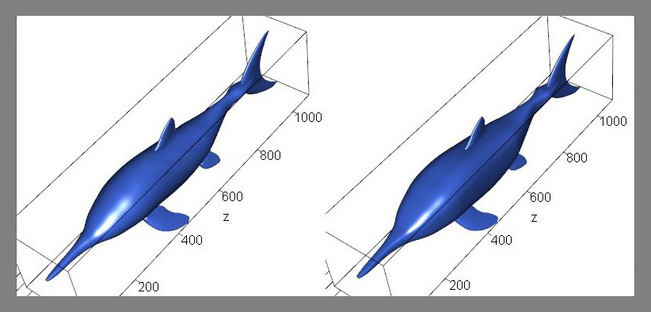

# Paleomass

R package for volume and surface area estimation of vertebrates through 3D models with superelliptical cross-sections

## What it does

This package first builds two 3D models of a marine vertebrate based on two orthogonal body silhouettes and planar views of the flippers and fins, supplied as image files. The true volume and surface area of the animal is expected to be bracketed between those of the two models. The two models have superelliptical cross-sections for the body but they differ in the superellipticla exponent. Flippers are modeled with NACA00XX foil sections.

## Quick Start

### Simplest Example Run

1. Load the paleomass package in R.  
`library(paleomass)`
2. If you haven't, move to the working directory that you want to use.  
`setwd("YourDirectory")`
3. Save example data on your hard drive.  
`save_Stenopterygius()`
4. Run paleomass.   
`paleomass()`
5. You will have the 3D models displayed and also saved as .ply files, so that  you can open it later in software of your choice.

6. You will also get calculation results displayed and also save in .csv files.
  

### Plesiosaur Example Run

1. As in the simplest example above.
2. As in the simplest example above.
3. Save Plesiosaurus example files.  
`save_Plesiosaurus()`
4. Run paleomass. You need to specify the data folder, length of the animal, and the positions/rotations of the flippers as below.  
`paleomass(Folder = "Plesiosaurus", fork.l = 2.94, Cfin = F, Dfin = F, ffin.onset = 450, hfin.onset = 650, ffin.adj.med = 10, hfin.adj.med = 40, ffin.adj.up = -160, hfin.adj.up = -160, ffin.spread = pi/3, hfin.spread = pi/4)`
5. You will get estiamted volumes and surface areas, as well as the 3D models. Apart from being displayed in R, the values are saved in a .csv file while the models are saved as .ply files so that you can open it later in software of your choice.

### Hammerhead Example Run

1. As in the simplest example above.
2. As in the simplest example above.
3. Save Plesiosaurus example files.  
`save_Sphyrna()`
4. Run paleomass. You need to specify the data folder, length of the animal, and the positions/rotations of the paired fins, median fins, and cephalofoil as below.  
`paleomass(Folder="Sphyrna", fork.l = 2, n2 = 1.8, Afin = T, D2fin = T, Ceph = T, ffin.onset = 300, ffin.adj.up = -120, ffin.adj.med = 40, ffin.spread = pi/4, ffin.sweep = -pi*0/180, hfin.onset = 550, hfin.adj.up = 10, hfin.adj.med = 40, hfin.spread = pi/4, hfin.thick = 10, hfin.sweep = pi*5/180, cfin.onset = 920, cfin.adj.up = 35, dfin.onset = 350, dfin.adj.up = 190, dfin.sweep = pi*5/180, d2fin.onset = 800, d2fin.adj.up = 200, d2fin.sweep=pi*5/180, d2fin.thick=10, afin.onset = 800, afin.adj.up = 60, afin.sweep = pi*20/180, afin.thick = 10, ceph.onset = -45, ceph.adj.up = 120, ceph.rot = pi/2)`
5. You will get estiamted volumes and surface areas, as well as the 3D models. Apart from being displayed in R, the values are saved in a .csv file while the models are saved as .ply files so that you can open it later in software of your choice.

## Detailed Guide
### 1. Prepare body silhouette images

1. 
